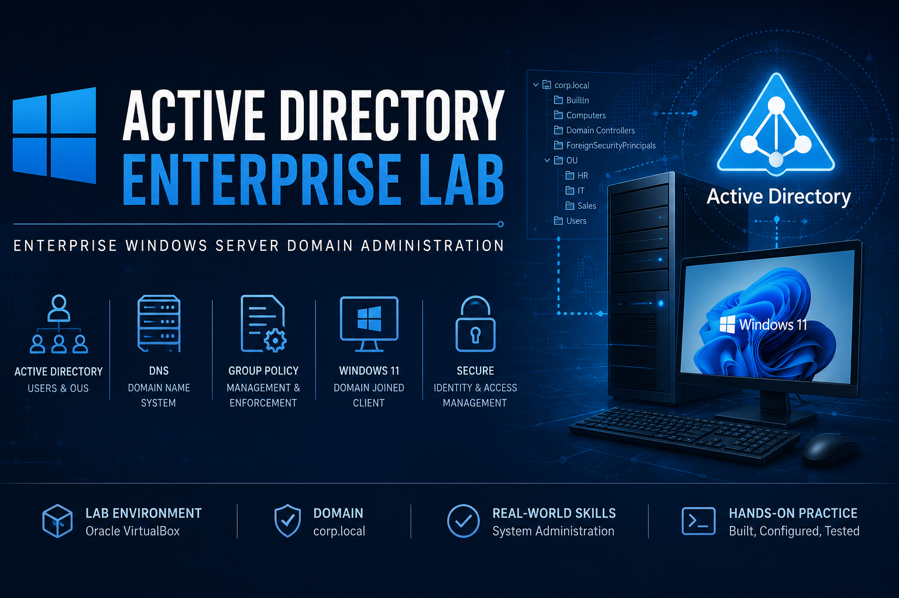
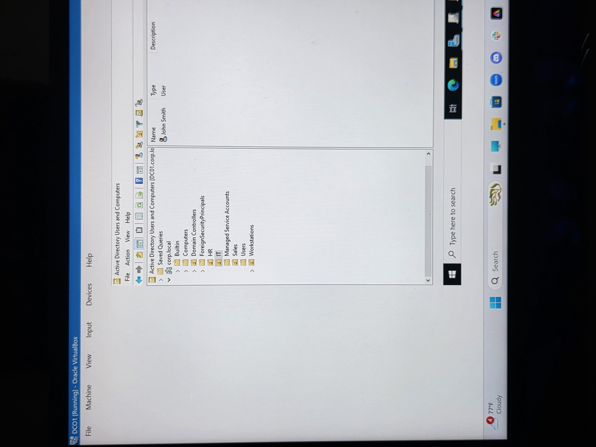
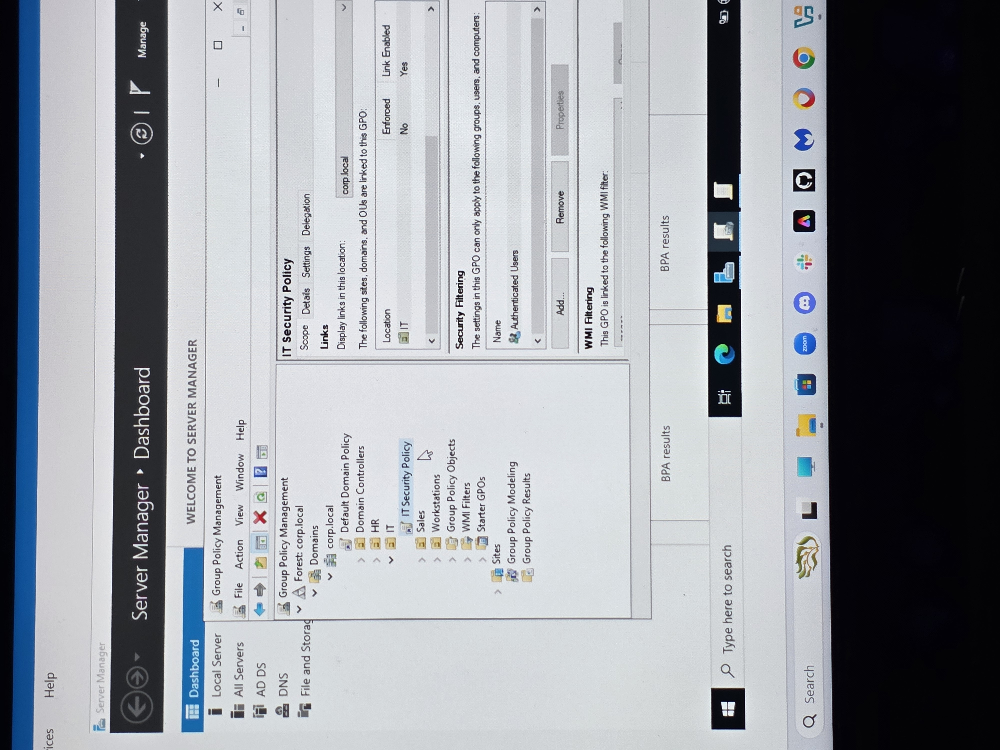
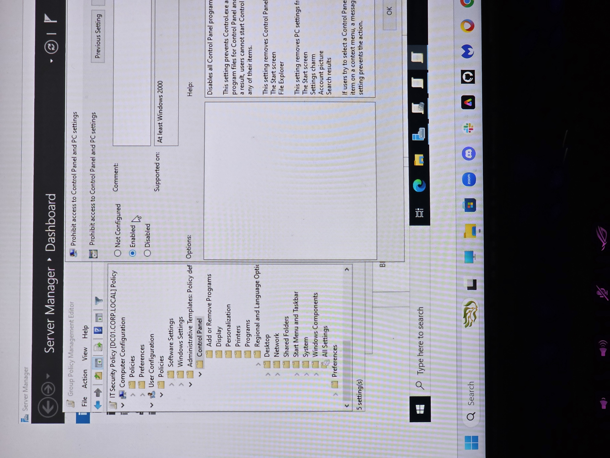
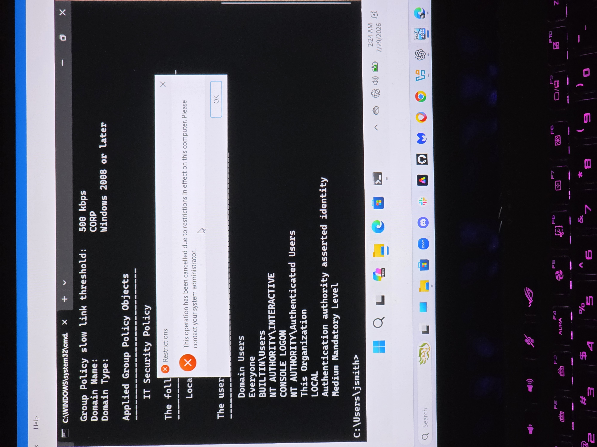

# Active Directory Enterprise Lab

## Enterprise Windows Server Domain Administration

**Project Type:** Home Lab  
**Environment:** Oracle VirtualBox  
**Operating Systems:** Windows Server, Windows 11  
**Domain:** corp.local

---

\# Active Directory Enterprise Lab

\## Project Overview

This project demonstrates the deployment and administration of a Windows Server Active Directory environment in Oracle VirtualBox. A Windows Server Domain Controller was configured to manage users, organizational units, authentication, DNS, and Group Policy. A Windows 11 client workstation was joined to the domain, authenticated with a domain account, and successfully received and enforced Group Policy settings.

\---

\## Objectives

\- Deploy a Windows Server Domain Controller

\- Configure Active Directory Domain Services (AD DS)

\- Configure DNS

\- Create Organizational Units (OUs)

\- Create and manage domain users

\- Join a Windows 11 client to the domain

\- Create and deploy a Group Policy Object (GPO)

\- Verify Group Policy enforcement

\---

\## Lab Environment

\- Oracle VirtualBox

\- Windows Server

\- Windows 11

\- Active Directory Domain Services

\- DNS

\- Group Policy Management

\---

\## Skills Demonstrated

\- Active Directory Administration

\- Windows Server Administration

\- DNS Configuration

\- User and Group Management

\- Organizational Unit Management

\- Group Policy Administration

\- Domain Authentication

\- Windows Client Administration

\- Troubleshooting

## Technologies Used

- Windows Server
- Active Directory Domain Services (AD DS)
- DNS
- Group Policy Management
- Windows 11
- Oracle VirtualBox
- Command Prompt

\---

\## Screenshots

### 1. Active Directory Structure

---

### 2. Domain-Joined Client

---

### 3. Group Policy Linked to IT OU

---

### 4. Group Policy Successfully Applied

---

### 5. Group Policy Configuration

---

### 6. Group Policy Enforcement

## Conclusion

This project demonstrates the deployment and administration of a Windows Active Directory environment from initial server configuration through client domain integration and Group Policy enforcement. The lab showcases foundational enterprise IT administration skills, including identity management, DNS configuration, Organizational Unit administration, Group Policy deployment, and Windows client management.
